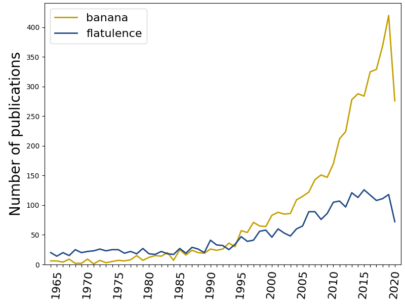

# Bibliographic banana for scale

If you're an academic, there's a big chance you've seen a graph of the yearly 
number of publications on a topic. This will likely have shown an increase, 
on the basis of which the writer concluded the topic was gaining in 
popularity. This, in short, was likely nonsense.

Academic research is ever expanding, and thus any visualisation of the number 
of publications on topic X will look like there is an increased interest in X. 
The solution is to normalise publication rates against the outputs of a whole 
discipline, but doing so can be very hard and require a lot of work.

The **bibliobanana** Python package can be used to more accurately quantify 
changes in academic interest. It comes with the following features:

- Loading bibliometric data from PubMed or Google Scholar on any topic

- Normalising publication rates on one or more keywords of interest with one or a collection of reference keywords.

- Storing bibliographic data in neatly organised text files.

- Plotting the raw, normalised, or max-scaled publication rates.

Example:



*Occurence of the word "flatulence" versus the word "banana" in PubMed-indexed 
articles between 1964 and 2020*


## Installation

**Option 1: Installing from the command line**
1) Make sure you have a running Python 3 installation.
2) Open a terminal (Linux or Mac OS X) or a command prompt (Windows)
3) Run the following command: `pip install bibliobanana`

**Option 2: Installing from Python**
1) Open Python.
2) Run the following commands:

```python
import pip
pip.main(["install", "bibliobanana"])
```

## Example 1

This example compares the publication numbers of articles referencing 
"flatulence" or "banana". It uses the convenience function 
`compute_yearly_citations` to not only collect results from PubMed, but also 
save them in a text file, and plot them in a graph.

```python
from bibliobanana import compute_yearly_citations

# Define the search and reference terms.
search_term = "flatulence"
comparison_term = "banana"
# Define the range of years to search in (both end-points are included).
start_date = 1964
end_date = 2020

# Construct the name of the text (data) and image (graph) files.
save_file = "{}_{}-{}".format(search_term, start_date, end_date)

# Run the PubMed searches, and save the outcomes to files.
# Note that the pause is set to 0.5 seconds. NCBI's API has a rate-limit of
# three requests per second. If you go over that, you will be blocked. The
# pause sets the inter-query wait time, so you could set it to 0.34 if you
# want to get close to the rate limit.
result = compute_yearly_citations(search_term, start_date, end_date, \
    comparison_terms=comparison_term, database="pubmed", pause=0.5, \
    verbose=True, save_to_file=save_file+".csv", plot_to_file=save_file+".png")
```

## Example 2

This example implements a comparison between several brain areas and the 
field-specific term "magnetic resonance imaging". It also illustrates how you 
can use **bibliobanana**'s storage and reloading functions, and how to use the 
different options in the plotting function.

```python
import os
from bibliobanana import compute_yearly_citations, load_results_from_file, \
    plot_yearly_count

# Define the search terms of interest.
search_terms = [ \
    "prefrontal cortex", \
    "visual cortex", \
    "cingulate cortex", \
    "amygdala", \
    "supplementary motor area", \
    "frontal eye fields", \
    ]

# Define the comperison terms.
comparison_terms = ["magnetic resonance imaging"]
# Define the search range.
start_date = 1990
end_date = 2018
# Construct the name of the file to which we should save the data.
save_file = "banana_brainareas_{}-{}".format(start_date, end_date)

# Get the results from PubMed.
if not os.path.isfile(save_file+".csv"):
    print("Getting data from PubMed...")
    result = compute_yearly_citations(search_terms, start_date, end_date, \
        comparison_terms=comparison_terms, database="pubmed", \
        exact_phrase=True, pause=0.5, verbose=True, \
        save_to_file=save_file+".csv", plot_to_file=None)
# Load from an existing file.
else:
    print("Loading data from file...")
    result = load_results_from_file(save_file+".csv")

print("Plotting results...")

# Plot the results.
fig, ax = plot_yearly_count(result, plot_ratio=False, \
    plot_average_comparison=False, scale_to_max=False, \
    figsize=(8.0,6.0), dpi=100.0)
fig.savefig(save_file+".png")

# Plot the results scaled to their own maximums.
fig, ax = plot_yearly_count(result, plot_ratio=False, \
    plot_average_comparison=True, scale_to_max=True, \
    figsize=(8.0,6.0), dpi=100.0)
fig.savefig(save_file+"_max-scaled.png")

# Plot the results as ratios of the comparison terms.
fig, ax = plot_yearly_count(result, plot_ratio=True, \
    plot_average_comparison=False, scale_to_max=False, \
    figsize=(8.0,6.0), dpi=100.0)
# Extend the y-axis upper limit.
ylim = ax.get_ylim()
ax.set_ylim(ylim[0], ylim[1]*1.3)
# Move the legend to the top-right.
ax.legend(loc="upper right")
# Save the figure.
fig.savefig(save_file+"_ratios.png")

# Plot the results as max-scaled ratios of the comparison terms.
fig, ax = plot_yearly_count(result, plot_ratio=True, \
    plot_average_comparison=False, scale_to_max=True, \
    figsize=(8.0,6.0), dpi=100.0)
# Move the legend to the top-right.
ax.legend(loc="upper right")
fig.savefig(save_file+"_max-scaled-ratios.png")

print("All done!")
```
